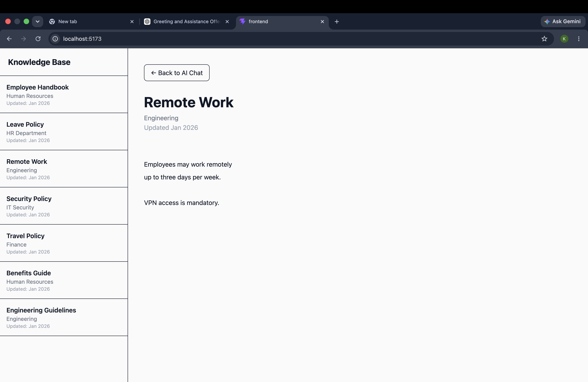

# Therech AI 🚀

Therech AI is an enterprise AI assistant built using **Retrieval-Augmented Generation (RAG)**. It enables employees to ask questions about company policies and documentation while falling back to general AI knowledge when the information is not available in the uploaded documents.

## Features

- 🤖 Enterprise AI chatbot
- 📚 RAG-based document retrieval
- 🧠 Local LLM using Ollama
- 📄 Knowledge Base with document viewer
- 🔍 Semantic search using ChromaDB
- ⚡ FastAPI backend
- 🎨 React + Tailwind frontend
- 📌 Source citations for company answers
- 🌐 General AI fallback for out-of-scope questions

---

## Tech Stack

### Backend
- FastAPI
- LangChain
- ChromaDB
- Ollama
- PyPDF

### Frontend
- React
- Vite
- Tailwind CSS

### Models
- **LLM:** `qwen3:8b`
- **Embeddings:** `mxbai-embed-large`

---

## Project Structure

```text
TherechAI/
│
├── backend/
│   ├── app.py
│   ├── ingest.py
│   ├── documents/
│   └── chroma_db/
│
├── frontend/
│   ├── src/
│   └── package.json
│
└── README.md
```

---

## Installation

### 1. Clone the repository

```bash
git clone <repository-url>
cd TherechAI
```

### 2. Install Ollama

Download from:

https://ollama.com/download

### 3. Pull the required models

```bash
ollama pull qwen3:8b
ollama pull mxbai-embed-large
```

### 4. Create a virtual environment

```bash
python3.12 -m venv venv
```

Activate it:

**macOS/Linux**

```bash
source venv/bin/activate
```

**Windows**

```bash
venv\Scripts\activate
```

### 5. Install dependencies

```bash
pip install -r requirements.txt
```

---

## Ingest Documents

Place your PDF files inside:

```text
backend/documents/
```

Run:

```bash
cd backend
python ingest.py
```

This creates embeddings and stores them in ChromaDB.

---

## Run the Backend

```bash
cd backend
uvicorn app:app --reload
```

Backend:

```
http://localhost:8000
```

Swagger UI:

```
http://localhost:8000/docs
```

---

## Run the Frontend

```bash
cd frontend
npm install
npm run dev
```

Frontend:

```
http://localhost:5173
```

---

## How It Works

1. User asks a question.
2. Relevant document chunks are retrieved from ChromaDB.
3. Qwen generates an answer using the retrieved context.
4. If no relevant company information is found, the assistant provides a general AI response with a disclaimer.

---

## API Endpoints

| Method | Endpoint | Description |
|---------|----------|-------------|
| GET | `/` | Health Check |
| GET | `/documents` | Fetch knowledge base documents |
| POST | `/query` | Ask Therech AI |

---
## Screenshots

### AI Chat



### Knowledge Base


## Future Improvements

- Streaming responses
- PDF upload from UI
- Authentication
- Chat history
- Hybrid search
- Docker deployment
- AWS deployment

---

## Built With

- FastAPI
- LangChain
- ChromaDB
- Ollama
- React
- Tailwind CSS
- Qwen 3
- mxbai-embed-large